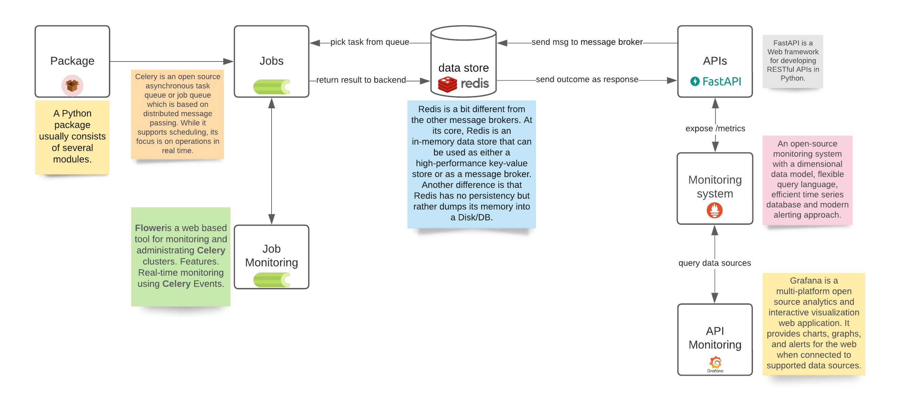

## Directory structure generation

01. UI Layer [Streamlit]
02. Application Layer [FastAPI]
03. ML Layer (R) [Plumber]
04. ML Layer (Python) [FastAPI]
05. ML Jobs (Python) [Celery Worker]
06. ML Jobs (R) [Celery Worker]
07. Redis (Python) [data store]
08. Redis (R) [data store]
09. Flower [celery monitor]
10. Prometheus [Prometheus]
11. Grafana [Monitoring]
12. Dozzle [Log monitoring]
13. Reporting Layer [FastAPI]
14. Utility Layer [FastAPI]
15. Reverse proxy [Nginx]
16. Project DB (postgres)
17. Data DB (postgres)
18. DB monitor (pdAdmin)


### Additional components:

* prometheus: add prometheus exported to expose metrics endpoint from all the container.
* grafana
* db admin
* logger
* nginx proxy manager

```bash
mkdir modern_app && mkdir -p ./modern_app/{ui_layer,application_layer,data_layer,ml_layer,reporting_layer,utility_layer,data_jobs,ml_jobs,data_lib,ml_lib}  && cd modern_app && touch README.md && find . -type d -empty -not -path "./.git/*" -exec touch {}/{.gitkeep,Dockerfile,README.md,.env,mkdocs.yml,VERSION,requirements.txt,Makefile,setup.py,pyproject.toml} \; && mkdir -p ./ui_layer/{app,data,backup,wiki,library} && mkdir -p ./application_layer/{app,data,backup,wiki,library} && mkdir -p ./data_layer/{app,data,backup,wiki,library} && mkdir -p ./ml_layer/{app,data,backup,wiki,library} && mkdir -p ./reporting_layer/{app,data,backup,wiki,library} && mkdir -p ./utility_layer/{app,data,backup,wiki,library} && mkdir -p ./data_jobs/{app,data,backup,wiki,library} && mkdir -p ./ml_jobs/{app,data,backup,wiki,library} && mkdir -p ./data_lib/{src,data,backup,wiki,notebooks} && mkdir -p ./ml_lib/{src,data,backup,wiki,notebooks} && find . -type d -empty -not -path "./.git/*" -exec touch {}/{README.md,.env,__init__.py,__main__.py} \; && git init && git add . && git commit -m "inital directory structure creation." && code .
```


```
docker network create stonehenge-network
```
## Steps:

1. create user with email and password
2. login using email id and password


## Dependency management

<p align="center">
  
</p>

### Reference:

* https://davidefiocco.github.io/streamlit-fastapi-ml-serving/
* https://github.com/pandalearnstocode/k8s_lab2/tree/feature/prometheus-grafana/toy_apps/ms
* https://testdriven.io/blog/fastapi-docker-traefik/
* https://stackoverflow.com/questions/44284484/docker-compose-share-named-volume-between-multiple-containers
* https://appsilon.com/r-rest-api/
* https://mlr3gallery.mlr-org.com/posts/2020-08-13-a-production-example-using-plumber-and-docker/
* https://linuxhint.com/use-nginx-proxy-manager/
* https://discuss.streamlit.io/t/streamlit-docker-nginx-ssl-https/2195/8
* https://www.kdnuggets.com/2020/10/deploying-secure-scalable-streamlit-apps-aws-docker-swarm-traefik-keycloak.html
* https://www.databentobox.com/2020/05/03/secure-shinyproxy/
* https://dockerswarm.rocks/
* https://www.digitalocean.com/community/tutorials/how-to-use-traefik-v2-as-a-reverse-proxy-for-docker-containers-on-ubuntu-20-04


## TODO:

* add reverse proxy
* add prometheus, grafana
* add loki, alert manager, data source redis, data source prometheus
* add db manager
* add dozzle
* add APIs in `utility_r` layer
* add stuff in libs, data layer, data jobs, data db and project db
* implement the e2e flow to show case the use case
* deploy using docker compose, swarm
* add TLS
* add DNS
* add basic login
* add shiny as container

Tracker:

* docker-compose.test.yml: working
* docker-compose.mini.yml (port 80 open, remaining closed): working
* docker-compose.mini.yml + proxy manager(port 443 open, remaining closed): NOT working, because of [this](https://discuss.streamlit.io/t/streamlit-docker-nginx-ssl-https/2195/8) issue.
* docker-compose.mini.ssl.yml: working (docker compose mode)