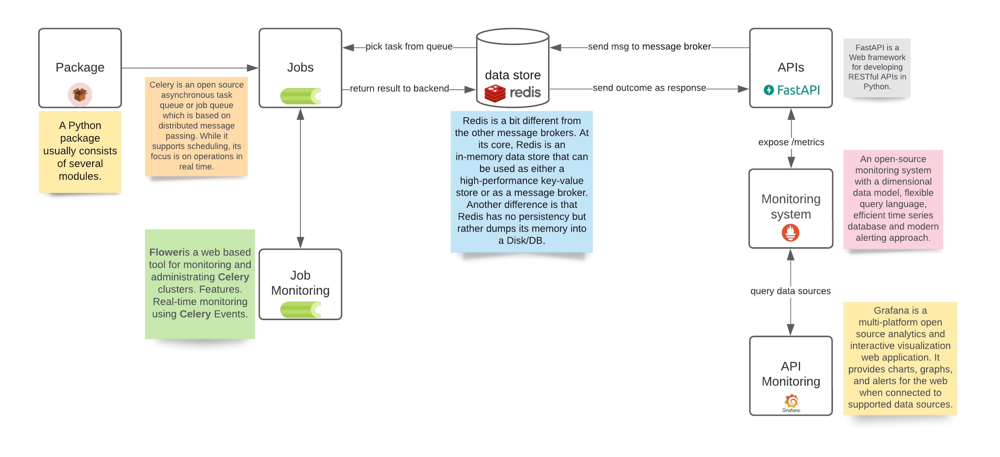

## Directory structure generation

01. UI Layer
    1.  segmentation: done
    2.  upload data csv
    3.  download data csv
    4.  user login
2.  Application Layer
3.  Data Layer
4.  ML Layer
    1.  segmentation: done
5.  Reporting Layer
6.  Utility Layer
7.  Data Jobs
8.  ML Jobs
9.  Data Lib
10. ML Lib


### Additional components:

* prometheus
* grafana
* db admin
* logger
* celery worker
* redis
* rabbit mq
* flower
* nginx proxy manager

```bash
mkdir modern_app && mkdir -p ./modern_app/{ui_layer,application_layer,data_layer,ml_layer,reporting_layer,utility_layer,data_jobs,ml_jobs,data_lib,ml_lib}  && cd modern_app && touch README.md && find . -type d -empty -not -path "./.git/*" -exec touch {}/{.gitkeep,Dockerfile,README.md,.env,mkdocs.yml,VERSION,requirements.txt,Makefile,setup.py,pyproject.toml} \; && mkdir -p ./ui_layer/{app,data,backup,wiki,library} && mkdir -p ./application_layer/{app,data,backup,wiki,library} && mkdir -p ./data_layer/{app,data,backup,wiki,library} && mkdir -p ./ml_layer/{app,data,backup,wiki,library} && mkdir -p ./reporting_layer/{app,data,backup,wiki,library} && mkdir -p ./utility_layer/{app,data,backup,wiki,library} && mkdir -p ./data_jobs/{app,data,backup,wiki,library} && mkdir -p ./ml_jobs/{app,data,backup,wiki,library} && mkdir -p ./data_lib/{src,data,backup,wiki,notebooks} && mkdir -p ./ml_lib/{src,data,backup,wiki,notebooks} && find . -type d -empty -not -path "./.git/*" -exec touch {}/{README.md,.env,__init__.py,__main__.py} \; && git init && git add . && git commit -m "inital directory structure creation." && code .
```


```
docker network create stonehenge-network
```
## Steps:

1. create user with email and password
2. login using email id and password


## Dependency management

<p align="center">
  
</p>

# Reference:
* https://davidefiocco.github.io/streamlit-fastapi-ml-serving/
* https://github.com/pandalearnstocode/k8s_lab2/tree/feature/prometheus-grafana/toy_apps/ms
* https://testdriven.io/blog/fastapi-docker-traefik/
* https://stackoverflow.com/questions/44284484/docker-compose-share-named-volume-between-multiple-containers
* https://appsilon.com/r-rest-api/